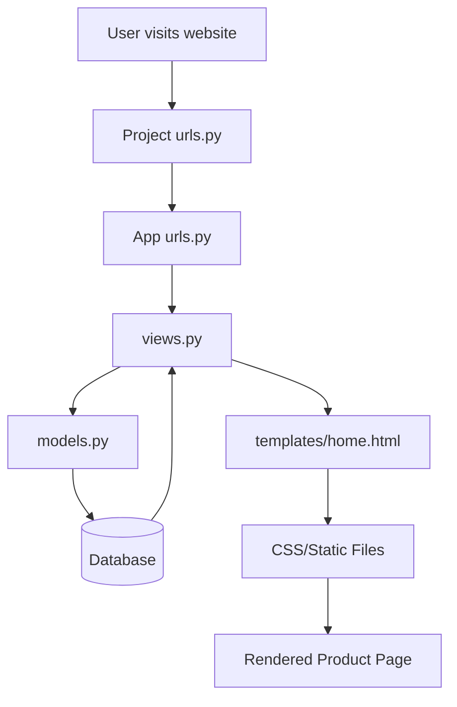

# Amazon Clone - Clothing E-Commerce (Django Project)

## Project Structure Overview

```
AMAZON/
├── DIANG0001/                # Django Project (Amazon)
│   ├── __init__.py
│   ├── settings.py           # Project settings
│   ├── urls.py               # Main URL routing
│   ├── asgi.py
│   └── wsgi.py
│
├── Clothes/                  # Django App (Product: Clothing)
│   ├── migrations/           # Database migrations
│   ├── templates/Clothes/    # HTML templates
│   │   ├── delete.html
│   │   ├── home.html         # Main product page
│   │   └── updates.html
│   ├── __init__.py
│   ├── admin.py              # Admin configuration
│   ├── apps.py
│   ├── forms.py              # Forms for product CRUD
│   ├── models.py             # Product models
│   ├── tests.py
│   ├── urls.py               # App-specific URLs
│   └── views.py              # Business logic
│
├── media/                    # Uploaded product images
├── products/                 # (Potential future expansion)
├── db.sqlite3                # SQLite database
├── manage.py                 # Django management
└── README.md
```

## Flowchart of Django Request Handling



## Setup Instructions

1. **Clone the repository**
   ```bash
   git clone https://github.com/yourusername/amazon-clone.git
   cd amazon-clone
   ```

2. **Create virtual environment**
   ```bash
   python -m venv venv
   source venv/bin/activate  # Linux/Mac
   venv\Scripts\activate     # Windows
   ```

3. **Install dependencies**
   ```bash
   pip install django pillow
   ```

4. **Run migrations**
   ```bash
   python manage.py migrate
   ```

5. **Create superuser (for admin)**
   ```bash
   python manage.py createsuperuser
   ```

6. **Run development server**
   ```bash
   python manage.py runserver
   ```

## Key Features

- **Product Management**:
  - Create/Read/Update/Delete clothing items
  - Product images handling via `media/` directory
  - Admin dashboard integration

- **Frontend Components**:
  - Responsive product grid (`home.html`)
  - Forms for product management (`forms.py`)
  - Bootstrap-friendly templates

## Customization Guide

1. **Add new product fields**:
   - Edit `Clothes/models.py`
   - Create new migration:
     ```bash
     python manage.py makemigrations
     python manage.py migrate
     ```

2. **Change styling**:
   - Add static files directory in `settings.py`
   - Create `static/` folder at project root
   - Link CSS in templates via `` tag

3. **Extend functionality**:
   - Add new views in `views.py`
   - Create corresponding URLs in `urls.py`
   - Design new templates in `templates/Clothes/`

## Troubleshooting

❗ **Template not found**:
- Ensure `DIRS` in `TEMPLATES` (settings.py) includes `os.path.join(BASE_DIR, 'templates')`

❗ **Media files not loading**:
- Add to `settings.py`:
  ```python
  MEDIA_URL = '/media/'
  MEDIA_ROOT = os.path.join(BASE_DIR, 'media/')
  ```
- Include in main `urls.py`:
  ```python
  from django.conf import settings
  from django.conf.urls.static import static
  
  urlpatterns += static(settings.MEDIA_URL, document_root=settings.MEDIA_ROOT)
  ```

## Contribution Guidelines

1. Fork the repository
2. Create feature branch (`git checkout -b feature/AmazingFeature`)
3. Commit changes (`git commit -m 'Add some AmazingFeature'`)
4. Push to branch (`git push origin feature/AmazingFeature`)
5. Open Pull Request

## License

MIT License - See LICENSE file for details

---

🛠 **Future Roadmap**:
- User authentication system
- Shopping cart functionality
- Payment gateway integration
- Product search and filtering
